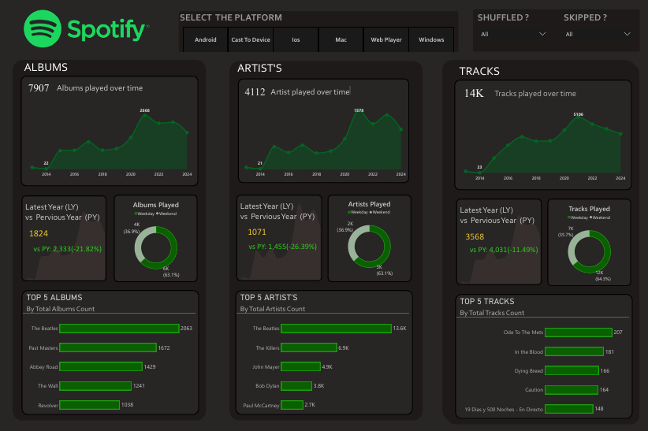
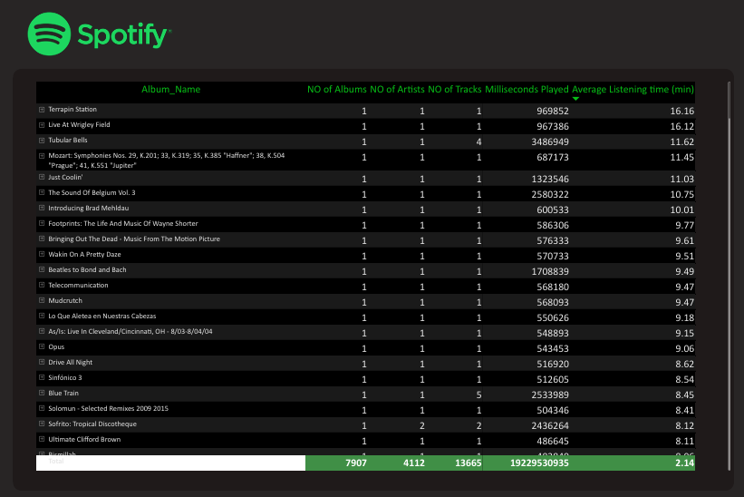

# 🎵 Spotify Listening Analytics Dashboard

<p align="center">


</p>

---

# 📑 Table of Contents

- Project Overview
- Business Problem
- Dashboard Preview
- Key Features
- Dataset
- Data Model
- Power Query Transformations
- DAX Measures
- Business Insights
- Recommendations
- Repository Structure
- Skills Demonstrated
- Future Improvements
- Contact

---

# 📌 Project Overview

This project is an interactive **Spotify Listening Analytics Dashboard** developed in **Microsoft Power BI** to analyze Spotify listening history.

The dashboard converts raw listening data into meaningful business insights through KPIs, trend analysis, interactive filtering, and advanced DAX calculations.

It allows users to identify listening behavior, compare yearly performance, discover favorite artists, albums, and tracks, and understand music consumption habits over time.

---

# 🎯 Business Problem

Streaming platforms generate massive amounts of user activity data.

Without visualization it becomes difficult to answer questions like:

- Which artists are listened to the most?
- How has listening changed over time?
- Which platform is used the most?
- Which albums receive the highest engagement?
- Are listening habits improving or declining each year?

This dashboard transforms raw listening history into an interactive Business Intelligence solution.

---

# 📷 Dashboard Preview

## Overview Page



---

## Listening Trends


---

## Details Page



---

# ✨ Key Features

✔ Interactive Dashboard

✔ Dynamic KPI Cards

✔ Year-over-Year Comparison

✔ Top 5 Artists

✔ Top Albums

✔ Top Tracks

✔ Listening Trend Analysis

✔ Scatter Plot Analysis

✔ Platform Analysis

✔ Dynamic Filtering

✔ Advanced DAX Measures

✔ Power Query Data Cleaning

---

# 📊 Dataset

Source:

Spotify Listening History (Personal Dataset)

Contains information such as:

- Track Name
- Artist
- Album
- Platform
- Listening Time
- Shuffle
- Skip Status
- Timestamp

---

# 🗂 Data Model

The report uses a Star Schema model.

```
              Date Table
                  │
                  │
      Spotify History Table
```

Relationship

Date[Date]
↓

Spotify History[ts]

---

# ⚙ Power Query Transformations

The following transformations were performed before loading the data:

- Removed unnecessary columns
- Changed data types
- Converted timestamps into Date format
- Created Year column
- Created Month column
- Created Hour column
- Renamed columns
- Removed errors
- Removed blank values
- Improved data consistency

---

# 📈 DAX Measures

The report includes advanced DAX calculations including:

- Total Albums
- Total Artists
- Total Tracks
- Latest Year KPIs
- Previous Year KPIs
- YoY Growth
- Min/Max Highlight
- Average Listening Time
- Track Frequency
- Conditional Formatting Logic
- Dynamic Parameters

Detailed explanations are available in:

Documentation/DAX-Measures.md

---

# 💡 Business Insights

Some key insights obtained from the dashboard:

- Listening activity changes significantly across years.
- A small group of artists contributes to a large percentage of listening activity.
- Certain albums dominate overall engagement.
- Listening frequency varies across platforms.
- Average listening duration reveals user engagement levels.
- Year-over-Year KPIs help identify growth or decline in listening behavior.
- Scatter plot analysis separates highly engaged tracks from low-engagement tracks.

Detailed insights:

Documentation/Insights-and-Recommendations.md

---

# 🚀 Recommendations

- Explore artists with increasing popularity.
- Build personalized playlists using highly engaged tracks.
- Improve recommendations based on listening duration.
- Analyze seasonal listening trends.
- Expand analysis using Spotify API.

---

# 📂 Repository Structure

```
Spotify-PowerBI-Dashboard/

│

├── README.md

├── Dataset/

│     └── spotify_history.xlsx

│

├── PBIX/

│     └── Spotify-Listening-Analysis-Dashboard.pbit

│

├── IMAGES/

│     ├── overview.png

│     ├── Listening-Trends.png

│     └── Details.png

│

└── Documentation/

      ├── Data-cleaning.md

      ├── DAX-Measures.md

      └── Insights-and-Recommendations.md
```

---

# 🛠 Skills Demonstrated

- Data Cleaning
- Data Transformation
- Data Modeling
- Star Schema
- DAX
- Power Query
- KPI Design
- Dashboard Design
- Business Intelligence
- Data Visualization
- Analytical Thinking

---

# 🔮 Future Improvements

Future versions of this project may include:

- Spotify API Integration
- Playlist Recommendation System
- Genre Analysis
- Device-wise Listening Analysis
- Monthly Listening Forecast
- Predictive Analytics using Python

---

# 👨‍💻 About Me

**Tushar Lohia**

Aspiring Data Analyst passionate about transforming raw data into meaningful business insights using Excel, SQL, Power BI and data visualization.

---

# 📬 Contact

- LinkedIn: [linkedin.com/in/tushar-lohia-ja311](https://www.linkedin.com/in/tushar-lohia-ja311)
- GitHub: [github.com/TusharLohia311](https://github.com/TusharLohia311)
